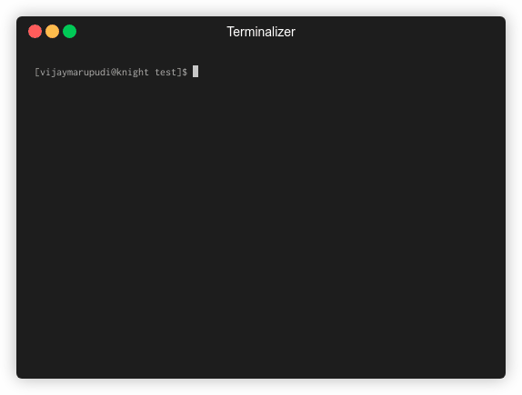
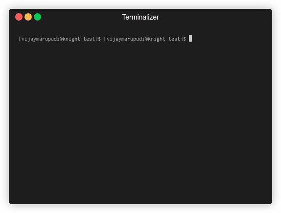

# nvim-fzf

An asynchronous Lua API for using `fzf` in Neovim (>= 0.5). Allows for full asynchronicity for UI speed and usability.

Preview:


Note how in the example above, information is passed freely between
neovim and `fzf`. Neovim is previewing the buffer in a split that you have
selected *in `fzf`*.  Using this library, you can perform anything in
response to `fzf` events and keybindings.

Some handcrafted useful commands at

* [`fzf-lua`](https://github.com/ibhagwan/fzf-lua)
* [`nvim-fzf-commands`](https://github.com/vijaymarupudi/nvim-fzf-commands).

Tested on Linux, MacOS, and Windows.

## Requirements

* `fzf` binary

## Usage

```lua
local fzf = require("fzf")

coroutine.wrap(function()
  local result = fzf.fzf({"choice 1", "choice 2"}, "--ansi")
  -- result is a list of lines that fzf returns, if the user has chosen
  if result then
    print(result[1])
  end
end)()
```



## Table of contents

* [Usage](#usage)
* [Installation](#installation)
* [Important information](#important-information)
* [API Functions](#api-functions)
* [Main API](#main-api)
* [Action API](#action-api-fzf-previews-bindings-actions-in-lua)
* [Helpers](#helpers)
* [Examples](#examples)
* [How it works](#how-it-works)
* [FAQ](#faq)

## Installation

```vimscript
Plug 'vijaymarupudi/nvim-fzf'
```

## Important information

**All `fzf` functions should be run in a coroutine.**

Example:

```lua
local fzf = require("fzf")

coroutine.wrap(function()
  local result = fzf.fzf({"choice 1", "choice 2"})
  if result then
    print(result[1])
  end
end)()
```

## API Functions

Require this plugin using `local fzf = require('fzf')`

* `fzf.fzf(contents, [fzf_cli_args], [options])`

  An fzf function that opens a centered floating window and closes it
  after the user has chosen.

  Example:

  ```lua
  local results = fzf.fzf({"Option 1", "Option 2"}, "--nth 1")
  if results then
    -- do something
  end
  ```

  `options`: an optional **table**, taking optional
  settings. You can use this to change the default floating window
  behavior or the fzf binary.

  * `options.width` (number): width of the window
  * `options.height` (number): height of the window
  * `options.row` (number): row from top where window starts
  * `options.col` (number): column from left where window starts
  * `options.relative` ('win', 'editor', 'cursor'): window position relative to
  * `options.border` (boolean | string | table, default: true): whether to display a border
    * if `border` is `false`, a border won't be shown
    * if `border` is `true`, a rounded border will be shown
    * if `border` is anything else, it is passed directly to
      `nvim_open_win`
  * `options.window_on_create` (function): a function that's
    called after the window is created. Use this function to configure
    the various properties of the window such as background highlight
    group.
  * `options.fzf_binary` (string): The name (or path) of the `fzf` (or
    `skim`) executable.
  * `options.fzf_cwd` (string): The path of the working directory to run
    the fzf command in.
  * `options.fzf_cli_args` (string): Additional fzf command line
    arguments to prepend to the arguments supplied to the fzf functions.
    This is only useful when used in conjunction with
    `fzf.default_options`.

  **NOTE**: `options` inherits its properties from
  `fzf.default_options`. If you'd like to change the defaults for
  all nvim-fzf functions, modify this table e.g.
  `require("fzf").default_options = { border = false }`

  Example:

  ```lua
  local results = fzf.fzf({"Option 1", "Option 2"},
    "--nth 1",
    { width = 30, height = 10, border = false })
  if results then
    -- do something
  end
  ```

* `fzf.fzf_relative(contents, [fzf_cli_args], [options])`

  An fzf function that opens a centered floating window relative to the
  current split and closes it after the user has chosen.
  (Same as setting `options.relative = 'win'`)

  Example:

  ```lua
  local results = fzf.fzf_relative({"Option 1", "Option 2"}, "--nth 1")
  if results then
    -- do something
  end
  ```

  `options`: an optional **table** taking optional
  settings. See `fzf.fzf` for information on settings.

* `fzf.provided_win_fzf(contents, [fzf_cli_args], [options])`

  Runs fzf in the current window, and closes it after the user has
  chosen. Allows for the user to provide the fzf window.

  ```lua
  -- for a vertical fzf
  vim.cmd [[ vertical new ]]
  fzf.provided_win_fzf(contents, fzf_cli_args)
  ```

* `fzf.raw_fzf(contents, [fzf_cli_args], [options])`

  An fzf function that runs fzf in the current window. See `Main API`
  for more details about the general API.

**NOTE**: nvim-fzf inherits nvim's environmental variables. This means
that options in `$FZF_DEFAULT_OPTS` and other environment variables are
respected. You can override them using command line switches or
`:let-environment`.

## Main API

`fzf(contents, [fzf_cli_args])`

* `contents`

  * if **string**: a shell command

    ```lua
    local result = fzf("fd")
    ```

  * if **table**: a list of strings or string convertibles

    ```lua
    local result = fzf({1, 2, "item"})
    ```

  * if **function**: `nvim-fzf` calls the function with a callback function to
    write vals to the fzf pipe. This api is asynchronous, making it
    possible to use fzf for long running applications and making the
    user interface snappy. Callbacks can be concurrent.

    * `cb(value, finished_cb)`

      * `value`: A value to write to fzf
      * `finished_cb(err)`: A callback called with an err if there is an
        error writing the value to fzf. This can occur if the user has
        already picked a value in fzf.

    ```lua
    local result = fzf(function(cb)
      cb("value_1", function(err)
        -- this error can happen if the user has already chosen a value
        -- before the information was sent to fzf
        if err then
          return
        end
        cb("value_2", function(err)
          if err then
            return
          end
          cb(nil) -- to close the pipe to fzf, this removes the loading
                  -- indicator in fzf
        end)
      end)
    end)
    ```

    The function is also called with two other optional arguments for more
    advanced usage.

    * The 2nd argument is a variant of the callback function (which is
      passed as the 1st argument), but it does not add newlines to the
      elements. This is useful to pass through information directly to
      the pipe.

    * The 3rd argument is the `vim.loop` / `luv` pipe to FZF. Use as you
      see fit!

* `fzf_cli_args`: **string**, A list of command line arguments for fzf.

    Can use to expect different key bindings (e.g. `--expect
    ctrl-t,ctrl-v`), previews, and coloring.

* **return values**

  * **table**, the lines that fzf returns in the shell
    as a table. If not lines are returned by fzf, the function returns nil
    for an easy conditional check.

    ```lua
    local result = fzf("fd")
    if result then
      -- do something with result[1]
    end
    ```

    ```lua
    local result = fzf("fd", "--multi")
    if result then
      -- do something with result[1] to result[#result]
    end
    ```

    ```lua
    local result = fzf("fd", "--expect=ctrl-t")
    if result then
      if result[1] == "ctrl-t" then
        -- do something with result[2]
      else
        -- do something with result[2]
      end
    end
    ```

  * **number**: Representing fzf's exit code.


## Action API (fzf Previews, Bindings, Actions in Lua)

Sometimes you want to use neovim information in fzf (such as previews of
non file buffers, bindings to delete buffers, or change colorschemes).
fzf expects a shell command for these parameters. Making your own shell
command and setting up RPC can be cumbersome. This plugin provides an
easy API to run a lua function / closure in response to these actions.

```lua
local fzf = require "fzf".fzf
local action = require "fzf.actions".action

coroutine.wrap(function()
  -- items is a table of selected or hovered fzf items
  local shell = action(function(items, fzf_lines, fzf_cols)
    -- only one item will be hovered at any time, so get the selection
    -- out and convert it to a number
    local buf = tonumber(items[1])

    -- you can return either a string or a table to show in the preview
    -- window
    return vim.api.nvim_buf_get_lines(buf, 0, -1, false)
  end)

  fzf(vim.api.nvim_list_bufs(), "--preview " .. shell)
end)()
```


`require("fzf.actions").action(fn, [fzf_field_expression])`

* `fn(selections, fzf_lines, fzf_cols)`: A function that takes a
  selection, performs an action, and optionally returns either a `table`
  or `string` to print to stdout. *This command is shell-escaped, so
  that you can easily append it to the `--preview` fzf cli argument.*

  * `selections`: a `table` of strings selected in `fzf`
  * `fzf_lines`: number of lines in the preview window i.e.
    `$FZF_PREVIEW_LINES`
  * `fzf_cols`: number of cols in the preview window i.e.
    `$FZF_PREVIEW_COLS`

* `fzf_field_expression` (string, optional, default: `"{+}"`): This fzf
  field expression determines what items are sent to the action
  function.

* **return value**: a shell-escaped string to append to the `fzf` command
  line arguments (`fzf_cli_args`) for `fzf` to run.


`require("fzf.actions").raw_action(fn, [fzf_field_expression])`

* Same as above, except it is not shell-escaped, so you can use it for
  complicated `--bind` functions. Take care to escape the result of
  this function before using it, as it contains spaces and quotes.

  ```lua
  local fzf = require("fzf").fzf
  local raw_action = require("fzf.actions").raw_action

  local raw_act_string = raw_action(function(args)
    -- do something with the args
  end)

  local bind_string =
  vim.fn.shellescape(string.format("--bind=ctrl-r:reload(%s)",
  raw_act_string))

  coroutine.wrap(function()
    fzf({1, 2, 3, 4}, "--multi " .. bind_string)
  end)()
  ```

`require("fzf.actions").async_action(fn, [fzf_field_expression])`


* `fn(pipe, selections, fzf_lines, fzf_cols)`: Similar to `action(...)`,
  but `fn` is passed an additional argument, the `libuv` / `vim.loop`
  pipe to `fzf`, as the first argument. Users can write to this pipe
  using `uv.write(pipe, data, callback)` and are expected to close the
  pipe using `uv.close(pipe)`.

  This function can be used for previews that take a long time to render
  and calculate from neovim.

`require("fzf.actions").raw_async_action(fn, [fzf_field_expression])`

* Same as above, except it is not shell-escaped, so you can use it for
  complicated `--bind` functions. Take care to escape the result of
  this function before using it, as it contains spaces and quotes.


## Helpers

Asynchronous programming is hard. For the case when you want to accept a
shell command, and simply transform each line into another line,
`nvim-fzf` has a helper function that returns a function that
asynchronously applies the transformation, which can be passed right
into `fzf`.

`require("fzf.helpers").cmd_line_transformer(cmd, fn)`

* `cmd`
  * if **string**: the shell command to transform
  * if **table**: a table taking the following properties
    * `cmd.cmd` (string): the shell command to transform
    * `cmd.cwd` (string, optional): the working directory to run the
      shell script in.
    * `cmd.pid_cb` (function, optional): a callback called with the pid
      of the shell command when available.
* `fn` (function): a function that takes as input a line from the shell
  command (string) and returns a new line to be sent to `fzf` (string).

```lua
local fzf = require("fzf")
local fzf_helpers = require("fzf.helpers")

coroutine.wrap(function()

  -- the transformation function runs for each line in the command
  local fzf_fn = fzf_helpers.cmd_line_transformer("seq 1000", function(x)
    local n = tonumber(x)
    return tostring(n * n)
  end)

  local choices = fzf.fzf(fzf_fn)

end)()
```

`require("fzf.helpers").choices_to_shell_cmd_previewer(fn,
[fzf_field_expression])`

* `fn(items, fzf_lines, fzf_cols)`: A function that is expected to
  return a shell cmd string to run asynchronously and feed to `fzf`.
  This allows the user to use Lua to parse the input from fzf before
  performantly using an external process to preview the output.

  ```lua
  local fzf = require("fzf")
  local helpers = require("fzf.helpers")


  coroutine.wrap(function ()
    local action = helpers.choices_to_shell_cmd_previewer(function(items)
      return "seq " .. vim.fn.shellescape(tostring(items[1])) 
    end)
    fzf.fzf("seq 1 1000", "--preview=" .. action)
  end)()
  ```

* `fzf_field_expression`: See above

## Examples

**Filetype picker**



```lua
local fts = {
  "typescript",
  "javascript",
  "lua",
  "python",
  "vim",
  "markdown",
  "sh"
}


coroutine.wrap(function()
  local choice = require "fzf".fzf(fts)
  if choice then
    vim.cmd(string.format("set ft=%s", choice[1]))
  end
end)()
```

**Colorscheme picker**

This example provides a live preview of the colorscheme while the user
is choosing between them. An example showing the advantages of nvim-fzf
and the `--preview` fzf cli arg.


```lua
local action = require("fzf.actions").action

local function get_colorschemes()
  local colorscheme_vim_files = vim.fn.globpath(vim.o.rtp, "colors/*.vim", true, true)
  local colorschemes = {}
  for _, colorscheme_file in ipairs(colorscheme_vim_files) do
    local colorscheme = vim.fn.fnamemodify(colorscheme_file, ":t:r")
    table.insert(colorschemes, colorscheme)
  end
  return colorschemes
end

local function get_current_colorscheme()
  if vim.g.colors_name then
    return vim.g.colors_name
  else
    return 'default'
  end
end


coroutine.wrap(function ()
  local preview_function = action(function (args)
    if args then
      local colorscheme = args[1]
      vim.cmd("colorscheme " .. colorscheme)
    end
  end)

  local current_colorscheme = get_current_colorscheme()
  local choices = fzf(get_colorschemes(), "--preview=" .. preview_function .. " --preview-window right:0") 
  if not choices then
    vim.cmd("colorscheme " .. current_colorscheme)
  else
    vim.cmd("colorscheme " .. choices[1])
  end
end)()

```


**Helptags picker**

This is a bit complex example that is completely asynchronous for
performance reasons. It also uses the `fzf` `--expect` command line flag.


```lua
local runtimepaths = vim.api.nvim_list_runtime_paths()
local uv = vim.loop
local fzf = require('fzf').fzf

local function readfilecb(path, callback)
  uv.fs_open(path, "r", 438, function(err, fd)
    if err then
      callback(err)
      return
    end
    uv.fs_fstat(fd, function(err, stat)
      if err then
        callback(err)
        return
      end
      uv.fs_read(fd, stat.size, 0, function(err, data)
        if err then
          callback(err)
          return
        end
        uv.fs_close(fd, function(err)
          if err then
            callback(err)
            return
          end
          return callback(nil, data)
        end)
      end)
    end)
  end)
end

local function readfile(name)
  local co = coroutine.running()
  readfilecb(name, function (err, data)
    coroutine.resume(co, err, data)
  end)
  local err, data = coroutine.yield()
  if err then error(err) end
  return data
end

local function deal_with_tags(tagfile, cb)
  local co = coroutine.running()
  coroutine.wrap(function ()
    local success, data = pcall(readfile, tagfile)
    if success then
      for i, line in ipairs(vim.split(data, "\n")) do
        local items = vim.split(line, "\t")
        -- escape codes for grey
        local tag = string.format("%s\t\27[0;37m%s\27[0m", items[1], items[2])
        local co = coroutine.running()
        cb(tag, function ()
          coroutine.resume(co)
        end)
        coroutine.yield()
      end
    end
    coroutine.resume(co)
  end)()
  coroutine.yield()
end

local fzf_function = function (cb)
  local total_done = 0
  for i, rtp in ipairs(runtimepaths) do
    local tagfile = table.concat({rtp, "doc", "tags"}, "/")
    -- wrapping to make all the file reading concurrent
    coroutine.wrap(function ()
      deal_with_tags(tagfile, cb)
      total_done = total_done + 1
      if total_done == #runtimepaths then
        cb(nil)
      end
    end)()
  end
end

coroutine.wrap(function ()
  local result = fzf(fzf_function, "--nth 1 --ansi --expect=ctrl-t,ctrl-s,ctrl-v")
  if not result then
    return
  end
  local choice = vim.split(result[2], "\t")[1]
  local key = result[1]
  local windowcmd
  if key == "" or key == "ctrl-s" then
    windowcmd = ""
  elseif key == "ctrl-v" then
    windowcmd = "vertical"
  elseif key == "ctrl-t" then
    windowcmd = "tab"
  else
    print("Not implemented!")
    error("Not implemented!")
  end

  vim.cmd(string.format("%s h %s", windowcmd, choice))
end)()
```

## How it works

This plugin uses a temporary named pipe, and uses it to communicate to
`fzf`.

## FAQ

* Does this conflict with `fzf.vim`?

  This library **does not conflict** with
  [`fzf.vim`](https://github.com/junegunn/fzf.vim) or the fzf vim API.

* How do I change the color of the default floating window spawned by
  `fzf.fzf`?

  You need to set the `winhl` option for the default window. You can do
  this for each command or globally by using the `window_on_create`
  option.

  This makes the background of the popup window the same color of the
  backgrounds of normal windows. Example:

  ```lua
  require("fzf").default_options = {
    window_on_create = function()
      vim.cmd("set winhl=Normal:Normal")
    end
  }
  ```
